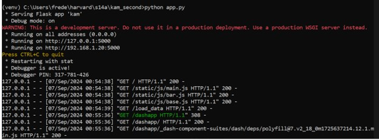
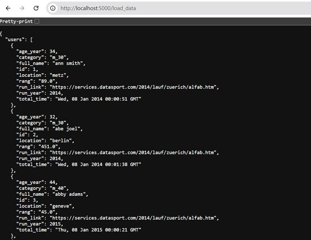
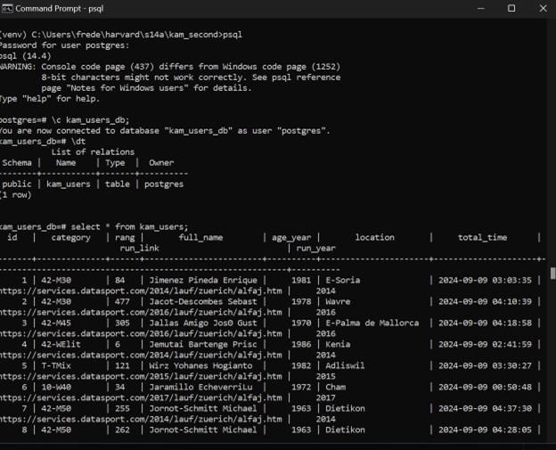

# Kamuno Analytics

## Configuration
- command: pip freeze > requirements.txt
- activate virtual environment
- command: python app.py



## Scrape Data
- Use Beautiful Soup into txt / csv


# Format Data

## Tranfer csv files from csv into postgres database
```
- seed_db.py to adhere with schema data types
- command: python seed_db.py
- Regex replace characters after "," for timestamp validation
- dates
```


## add to the dataset - age group and count
```
- command: python refine_seed.py
- Create age group attribute
```

## API
```
- Flask
- seed_db.py validated by Flask forms into Postgres
- API route /load_data created to output records
```



## Postgres
```
- connect to Postgres SQL database
```




## Visualize
- Plotly and Dash

## LLM AI
- Azure Cloud

