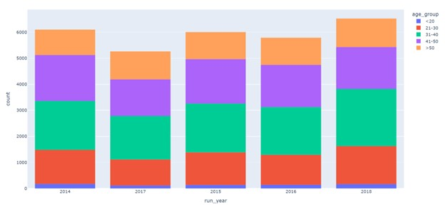

# Swiss Analytics

## URL: https://kam-second.onrender.com/

## LLM AI

```
"The marathon is not really about the marathon - it's about the shared struggle.
 And it's not only the marathon but the training."
-Bill Buffum, Boulder Road Runners

- Marathon sites focus on the physical metrics as a measure of performance.
- The App shows more than just running time records of the Zurich marathon.
- We introduce the "mental" aspect of running a marathon.
```

- Azure AI Cloud

```
- A feature of uplifting and inspiration quotes is attached to the original dataset,
on how each runner provides their reason for running the race.

- Azure AI creates embeddings of this feature in python and postgres to provide
 recommendations for current and potential runners on how to succeed.
```

- Runners can now query what on their mind is causing a roadblock.

- Azure AI will recommend runners who feel the same way
and share their guidance on how to push through the mental challenge.


# Motivation for App

```
- 2 days ago I was involved in a serious bicycle accident that cracked my helmet.
 It put me in a tough spot.

- I needed a reason to Motivate and push through the challenges of doubt and injury.

- So I though of creating an app with inspirational quotes to reframe my mindset.
```


```
- First, I tried to hack the embeddings with Langchain.
- However, recommendations were sparse and even unavailable from the LLM.
```


```
- Then I made improvements using Azure AI.
- I took in advice from the Microsoft RAGHack livestreams such how adding markdowns to csv
can have an affect with LLM's and learned the limitations of my app to make future improvements.
* Flask does not the async functionality of FastAPI for faster processing from the LLM.
* Importance of providing sources to LLM results and have them in my dataset.

```


```
- The result has made an impact.
For instance, I asked "Can you provide inspirational quotes to get over my accident?"

- Azure AI responded from Ebert and Liedtke with "Sometimes life hits you in the head with a brick.
Don't lose faith." and "You may find your exasperation turns to inspiration", respectively.


- The intention is to feel better after reading these positive thoughts.
- I hope to continue improving the app so that runners can focus on their perspective that can transform
challenges into growth.

- In the future, the app could find runners with like-minded reasons for overcoming the marathon
to run together as a group or at least know they are in the race.
- They can validate their success after the race.
This would be something cool to build upon.
```

- app has bugs, but ipynb (graphs_azure.ipynb) shows working example of Azure AI.
<video controls src="kam/static/raghack.mp4" title="Title"></video>
- Video: https://drive.google.com/file/d/1803szzAFOaZnbmmcTiGDK0iUmWEitYHW/view?usp=drive_link


## Running for Cause over for Records


## Configuration
- command: pip freeze > requirements.txt
- activate virtual environment
- command: python app.py


## Scrape Data
- Use Beautiful Soup into txt / csv


# Format Data

## Tranfer csv files from csv into postgres database
```
- seed_db.py to adhere with schema data types
- command: python seed_db.py
- Regex replace characters after "," for timestamp validation
- dates
```


## add to the dataset - age group and count
```
- command: python refine_seed.py
- Create age group attribute
```

## API
```
- Flask
- seed_db.py validated by Flask forms into Postgres
- API route /load_data created to output records
```


## Postgres
```
- connect to Postgres SQL database
```


## Visualize
- Plotly and Dash





